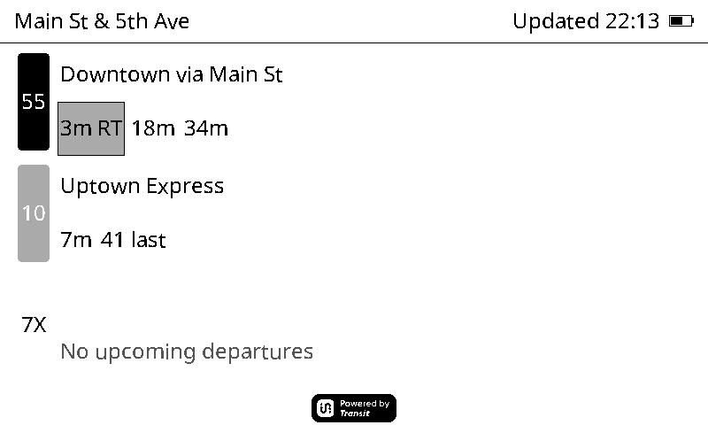
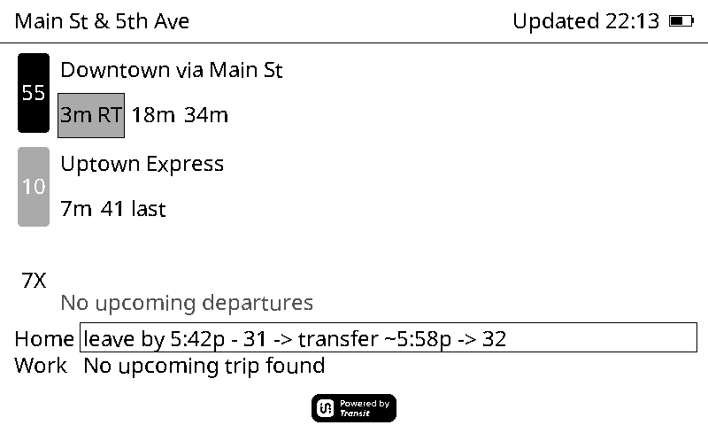
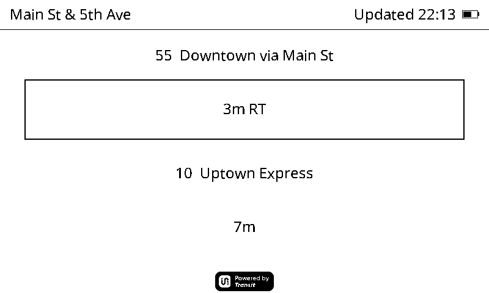
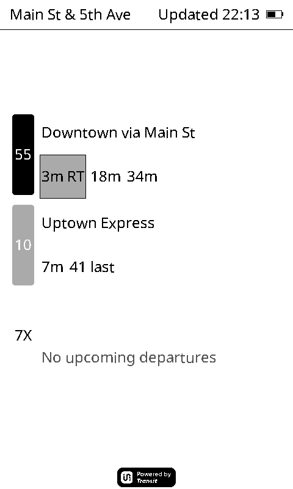
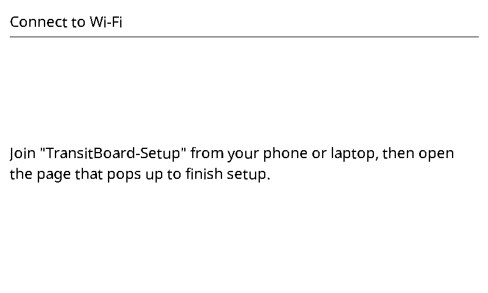

# Transit-Elnk-Firmware

ESP32 firmware for the Xteink X4 (800×480, 4-gray e-ink) that shows next
transit departures for a stop — the same job as the Transit app's main
screen, and of the Transit-NearbyWebWidget / Transit-TV reference apps,
rendered to e-ink instead of a browser. Battery-powered: it wakes on a
timer, fetches departures, draws the board, and deep-sleeps.

Built on the [FreeInk SDK](https://github.com/Free-Ink/freeink-sdk)
(vendored as a git submodule at `freeink-sdk/`) and PlatformIO/Arduino-ESP32.

## What it looks like

Real rendered frames, not mockups: these come straight out of
`test/test_render_snapshot`, which drives the actual `RenderEngine` through
a host draw target that rasterizes into a grayscale buffer. Regenerate them
with `tools/refresh_screenshots.sh` after any layout change (see
[Screenshots](#screenshots) below).

| | |
|---|---|
|  **Normal board** |  **With "Home"/"Work" preset trips** |
|  **Focus mode** |  **Offline, showing cached data** |
|  **Portrait orientation** |  **First-run setup prompt** |

## Hardware

- **Board**: Xteink X4 — ESP32-C3, SSD1677 e-ink controller, 800×480,
  4-level grayscale.
- **No touch, no built-in keyboard, no GPS, no RTC chip** — first-run setup
  and time sync are designed around those constraints (see below). There's
  no battery-backed clock, so time comes from SNTP on each wake; what the
  ESP32 *does* have is a few KB of RTC memory that survives deep sleep,
  which is what keeps an approximate clock running when there's no network
  to sync against.

## First-run setup

On first boot (or whenever `wifi_ssid`/`api_key`/`stop_id` aren't all set),
the device hosts its own Wi-Fi access point (`TransitBoard-Setup`) with a
captive-portal web page — connect a phone or laptop to that network, a
setup page should open automatically (or visit `http://192.168.4.1`).
From there: pick/enter your Wi-Fi network, enter and validate a
[Transit API](https://transitapp.com/apis) key, then search for and pick
your stop. Each step is saved as soon as it's confirmed, so an interrupted
setup resumes where it left off rather than starting over.

Before requesting an API key, see root [`CLAUDE.md`](CLAUDE.md) for the
walkthrough (free vs. paid tier, rate limits, where the key is stored —
**never compiled into tracked source**; it's entered on-device and stored
in NVS).

## Settings (after first-run)

A long power-button hold at boot on an already-provisioned board opens a
second, smaller version of the same captive-portal page — a settings
portal for things that aren't part of first-run setup:

- **Display orientation** — landscape (the panel's native orientation) or
  portrait.
- **STA departures** — optionally show Spokane Transit Authority arrivals
  alongside Transit's, by entering the numeric stop code printed on a
  physical STA stop sign. An SD card (the X4 has a real slot) is optional
  on top of this — it carries STA's full static GTFS data for real
  per-trip headsigns/direction grouping, where the board otherwise falls
  back to smaller always-available flash tables. See
  [`docs/STA_INTEGRATION.md`](docs/STA_INTEGRATION.md) for how that data
  source (and the SD card layer) works, and its compliance notes.
- **"Home"/"Work" preset trips** — optionally save a fixed route chain
  (e.g. bus 31, transfer to 32) to two named destinations, so the board
  shows a "leave by" time and each transfer stop/time alongside the normal
  departure board, instead of just raw times at the one configured stop.
  See [`docs/TRIP_PLANNER.md`](docs/TRIP_PLANNER.md) for how a chain is
  configured and how a plan is computed.
- **Focus mode** — a reduced-clutter toggle that draws only the 1-2
  soonest departures, larger, instead of the full multi-route board.
- **Bus Wi-Fi sign-in** — optionally name an open Wi-Fi network (onboard
  transit Wi-Fi, say) to fall back on when the home network isn't in range,
  plus the email or phone to hand its sign-in page. The board reads that
  page's own form to work out where to send it, and verifies it actually
  got online rather than assuming. See
  [`docs/OFFLINE_AND_BUS_WIFI.md`](docs/OFFLINE_AND_BUS_WIFI.md).

## Offline behavior

Carried out of range of its network, the board keeps working on what it
already knows:

- The **last fetched board is cached** and redrawn, marked `Offline` and
  `Cached 2h ago` in the header, with departures that have already left
  pruned out. A cache left offline long enough empties itself rather than
  showing stale times as if they were live.
- An **approximate clock** in RTC memory survives deep sleep, so countdowns
  ("3m", "18m"), "leave now" urgency, and sleep-window math all still work
  without SNTP. It's marked with a leading `~`, and the board stops showing
  it once its accumulated error bound gets too wide to be useful (~a day
  offline at the hourly default) rather than presenting a guess as the time.

Both are covered in [`docs/OFFLINE_AND_BUS_WIFI.md`](docs/OFFLINE_AND_BUS_WIFI.md),
including an honest account of the clock's accuracy and of what the
captive-portal sign-in can and can't handle.

## Building

```sh
git submodule update --init --recursive   # freeink-sdk, needed once per clone
pip install -U platformio

pio run -e xteink_x4      # real firmware build (ESP32-C3)
pio test -e native        # host-side unit tests, no hardware/toolchain needed
```

`pio run -e xteink_x4` downloads an ESP32 toolchain on first run — allow a
few minutes. CI (`.github/workflows/ci.yml`) runs both on every push/PR.

### Screenshots

```sh
tools/refresh_screenshots.sh          # regenerate docs/screenshots/*.png
python3 tools/png_recompress.py docs/screenshots/*.png
```

A plain `pio test -e native` writes these frames to the gitignored
`.pio/test-output/render_snapshot/`, so running the test suite never dirties
the working tree; the script redirects them into the tracked directory
instead (via the `SNAPSHOT_OUT_DIR` the test honors). The recompress step is
separate because the host PNG writer emits uncompressed deflate to avoid a
zlib dependency — ~384 KB a frame, against ~4 KB after. Run both after any
layout change so the images above match what the firmware actually draws.

## Project layout

| Path | Contents |
|---|---|
| `src/main.cpp` | Boot → setup-if-unprovisioned → Wi-Fi + fetch → render → deep sleep |
| `src/transit/`, `include/transit/` | Implementation and headers for each module: data model & JSON parsing (`models`), Transit API v4 client (`api_client`), NVS config store (`config_store`), departure filter/sort/badge logic (`ui_logic`), e-ink layout and drawing (`render_engine`), route-icon SVG fetch/rasterize (`icon_cache`, `svg_path`), wake/sleep scheduling (`power_scheduler`), captive-portal setup + settings (`setup_flow`), preset "Home"/"Work" trip-transfer planning (`trip_planner` — see `docs/TRIP_PLANNER.md`), STA (Spokane Transit Authority) second data source (`sta_*` — see `docs/STA_INTEGRATION.md`), offline support (`time_keeper` RTC-memory clock, `offline_cache` last-known-good board, `captive_portal` open-network sign-in — see `docs/OFFLINE_AND_BUS_WIFI.md`) |
| `test/` | Host-side Unity tests for the hardware-independent modules (`pio test -e native`) |
| `tools/gen_sta_tables.py` | Regenerates the baked-in STA route/stop tables from a fresh GTFS feed |
| `tools/refresh_screenshots.sh`, `tools/png_recompress.py` | Regenerate and shrink the rendered PNGs under `docs/screenshots/` |
| `freeink-sdk/` | Vendored SDK submodule — display driver, UI framework, board config, power management, etc. |
| `docs/` | Design spec this firmware is built against (see table below) |

## Documentation

These reference docs are the spec the firmware is built against — written
from the running behavior of Transit-NearbyWebWidget and Transit-TV plus
the Transit API v4 OpenAPI spec, not re-derived by reading JS source at
implementation time.

| Doc | Covers |
|---|---|
| [`docs/API_CONTRACT.md`](docs/API_CONTRACT.md) | Annotated v4 schema for `nearby_routes`, `stop_departures`, `nearby_stops`, `search_stops` |
| [`docs/DATA_MODEL.md`](docs/DATA_MODEL.md) | Canonical `merged_itineraries`/`schedule_items` shape, mapped from both repos' partial v3-shaped reads |
| [`docs/UI_BEHAVIOR.md`](docs/UI_BEHAVIOR.md) | Refresh cadence, departure-window cutoffs, sort/filter/badge rules |
| [`docs/CONFIG_AND_STATE.md`](docs/CONFIG_AND_STATE.md) | Every user-configurable value today, and the NVS `ConfigStore` key mapping |
| [`docs/ASSETS_ICONS.md`](docs/ASSETS_ICONS.md) | Route icon/color source and the SVG→4-gray-bitmap conversion path |
| [`docs/DEPLOYMENT_OPS.md`](docs/DEPLOYMENT_OPS.md) | API key tier limits and what "continuous" polling actually costs |
| [`docs/STA_INTEGRATION.md`](docs/STA_INTEGRATION.md) | Spokane Transit Authority: the second, optional data source — how it's fetched, the baked-in route/stop tables, and its compliance notes |
| [`docs/TRIP_PLANNER.md`](docs/TRIP_PLANNER.md) | Preset "Home"/"Work" trip-transfer chains — how a plan is computed from `stop_departures()` data, direction disambiguation, the settings UX, and known limitations |
| [`docs/OFFLINE_AND_BUS_WIFI.md`](docs/OFFLINE_AND_BUS_WIFI.md) | What works with no network: the RTC-memory approximate clock and its real accuracy, the NVS board cache and how it ages, and captive-portal sign-in on an open network (detection, form discovery, manual override, limitations) |
